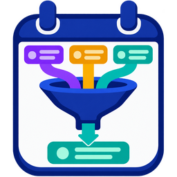

# filtered_calendar_merger

Filtered Calendar Merger is a custom component for Home Assistant that  one-way syncs events **from** one or more source calendars **to** a destination calendar, and keeps them in sync on a schedule you control.



For each destination calendar, you choose source calendars to copy in full and/or source calendars to filter by title. It keeps things in sync by hashing each source event and storing the first 8 characters of that hash at the end of the copied event's description, so it can tell what it created, what changed, and what should be removed.

**Which Calendar Integrations Work?**

- CalDAV:
    - Only works as a `from` calendar - the integration can't create events.
- Google Calendar:
    - Works as both `from` and `to` if it's set up with two-way sync permissions.
- Local Calendar:
    - Works as both `from` and `to`.
- Remote Calendar:
    - Only works as a `from` calendar - events are read-only/imported.

## Background

I saw the Skylight calendar and thought it looked cool. But I didn't like that I'd have to use their app to attach the events to a child's calendars. My partner and I already have a good system in place that we like. I built this tool to automate it, so our kids can see their events.

### Our Family's Process

I have an iCloud calendar and I share it with my partner. My partner also has an iCloud calendar and shares it with me. This is useful because if my partner adds an event titled "Dentist," I know it's for them. This came in handy when designing this component too, because I can just say "copy all of the events from my shared calendar to my local calendar named dad" (see `Copy all events from` below).

When my partner or I create events for the kids, we put their name in the event. This component looks for keywords (e.g. their name) in the parent calender and copies those events to their calendars.

## Features

- Works with CalDAV (iCloud), Google Calendar, and Local Calendar entities
- **Configured entirely through the UI** - Settings -> Devices & Services -> Add Integration
- Copies events from one or more `from` calendars into a `to` calendar and keeps them in sync automatically on a schedule you set (in minutes)
- A **"Sync now" button** and a **"Last sync" sensor** (with events-added / events-removed / error counts) are created for every sync you configure
- A `filtered_calendar_merger.sync` action is still available for automations, and can target one sync or all of them
- If an event is added directly to a `to` calendar, it will not be touched by this integration
- Specify how many days into the future (and past) to sync
- Ignore source events whose title starts with a character you choose
- Choose full-sync and filtered source calendars independently for each destination
- Filtered sources can match many title keywords or phrases (e.g. a name, "family", "with kids")
- Only deletes a `to` event if this integration created it **and** the matching source event is gone or no longer matches
- A single bad event (e.g. a calendar backend rejecting one create call) is logged and skipped rather than aborting the whole sync run

## Install

This component is installed via [HACS](https://hacs.xyz).

1. Install HACS first
1. Go to **HACS** > **⁝** > **Custom repositories**
1. Add this repository and choose **Integration**, then click **ADD**
1. Go back to the main HACS landing page and search `Filtered Calendar Merger`
1. Click on it, then click **Download**
1. Restart Home Assistant

## Configuration

Filtered Calendar Merger is configured entirely through the UI; YAML configuration is not supported.

1. Go to **Settings -> Devices & Services -> Add Integration**
1. Search for **Filtered Calendar Merger**
1. For each destination calendar you want to sync events into, add a new instance:
   - **Sync to calendar** - the destination calendar (e.g. `calendar.snoop`)
   - **Sync every event from these calendar(s)** *(optional)* - sources whose events are all copied
   - **Sync matching events from these calendar(s)** *(optional)* - sources from which only matching events are copied
   - **Match these words or phrases in the event title** - required when using filtered sources; e.g. a name, "family", or "with kids"
   - **Do not sync events whose title starts with** *(optional)* - e.g. `!` for private events the kids don't need to see
   - **Days ahead / Days in the past to sync** - the component uses complete calendar days. The default of 7 days ahead and 0 days in the past copies all of today plus the next seven days; it includes an event that finished earlier today. Increase the past value to include complete earlier dates.
   - **Sync every (minutes)** - how often this sync runs automatically; the default is 720 minutes (12 hours). Enter `0` to disable automatic and startup syncs, then run it with the **Sync now** button or the `filtered_calendar_merger.sync` automation action.
1. Repeat for each destination calendar

> Select at least one source calendar. A source calendar may be in either full sync or filtered sync, but not both.

### How filtering works

Filtering looks at the event **title only**, not its description or location. Each keyword or phrase is matched case-insensitively at word boundaries, so `with kids` matches `Dinner With Kids` and `kids` matches `Kids' soccer`, but `art` does not match `party`. Punctuation around a match is fine.

The optional ignore prefix is checked against the title first, before full or filtered sync. It is case-sensitive: entering `!` prevents `!Private appointment` from being copied, even if its source is a full-sync calendar or its title otherwise matches a keyword.

### Synced-event marker

Filtered Calendar Merger appends an eight-character marker such as `[a1b2c3d4]` to the **end** of every description it creates. This marker identifies an event as integration-managed and lets Filtered Calendar Merger avoid duplicates and remove stale copies. A bracketed value elsewhere in a description is ignored.

If you edit a copied event manually, keep the marker at the end if you want Filtered Calendar Merger to continue managing it. Adding text after the marker makes it a normal, unmanaged destination event.

### Common setups

| Goal | Sync every event from | Sync matching events from | Title keywords | Destination |
|---|---|---|---|---|
| One complete calendar into another | `calendar.personal` | *(none)* | *(none)* | `calendar.family` |
| Two calendars combined into a third | `calendar.parent_one`, `calendar.parent_two` | *(none)* | *(none)* | `calendar.household` |
| Only events marked for the kids | *(none)* | `calendar.personal` | `with kids` | `calendar.kids` |

For the last setup, enter `!` as the ignore prefix to exclude titles such as `!With kids - surprise`.

Each configured sync gets its own device with two entities:
- `sensor.<to_calendar>_last_sync` - timestamp of the last run, with `events_added`, `events_removed`, and `errors` attributes
- `button.<to_calendar>_sync_now` - triggers an immediate sync

### Example setup

Family structure:
  - Napoleon Dynamite (dad) - `calendar.napoleon_dynamite`
  - Nomi Malone (mom) - `calendar.nomi_malone`
  - Snoop (kid) - `calendar.snoop`
  - Scott Pilgrim (kid) - `calendar.scott_pilgrim`
  - Cupid (kid) - `calendar.cupid`

You'd add **five** Filtered Calendar Merger instances, one per destination calendar:

| Sync to | Sync every event from | Sync matching events from | Title keywords |
|---|---|---|---|
| `calendar.dad` | napoleon_dynamite | nomi_malone | dad, napoleon, family |
| `calendar.mom` | nomi_malone | napoleon_dynamite | mom, nomi, family |
| `calendar.snoop` | *(none)* | napoleon_dynamite, nomi_malone | snoop, family, kids, kiddos |
| `calendar.scott_pilgrim` | *(none)* | napoleon_dynamite, nomi_malone | scott, family, kids, kiddos |
| `calendar.cupid` | *(none)* | napoleon_dynamite, nomi_malone | cupid, family, kids, kiddos |

Here is what the synced calendar looks like:


### The `filtered_calendar_merger.sync` action

Since every sync already runs on its own schedule, you shouldn't need this for normal use - but it's there for automations that want to force an immediate sync (e.g. after a "I just added an event" trigger).

```yaml
# Sync everything
action: filtered_calendar_merger.sync

# Sync just one destination calendar's config entry
action: filtered_calendar_merger.sync
data:
  config_entry_id: 01ABCXYZ...   # find this on the sync's device page
```

Or just press its **Sync now** button instead.

## Development

```bash
pip install -r requirements-test.txt
pytest
```

Tests are split by concern:
- `tests/test_filtered_calendar_merger.py` - the sync engine itself (hashing, keyword matching, date-handling edge cases, the `copy_all_from` regression, error isolation) against a lightweight fake `hass`
- `tests/test_config_flow.py` - the config flow and options flow, using the real Home Assistant test harness
- `tests/test_init.py` - entry setup/unload and the `filtered_calendar_merger.sync` action

## TODO

- [ ] Add check if `to` calendar is CalDAV and raise a clear error, since Home Assistant can't create events on a CalDAV entity
- [ ] Run sync when a source event changes, not just on the interval
- [ ] Case-sensitive keyword matching option
- [ ] Support to-do lists in addition to calendars
- [ ] Friendlier error surfaced in the UI if a `to` calendar can't accept created events (e.g. read-only CalDAV/Google without two-way sync)

### User stories and use cases covered by this integration

#1: A user want to sync a whole calender with another calender. Like a clone

#2: A user want to sync two separate calenders into one third calender. Like if different services publish a calendar and want to merge the info

#3 A user want sync all event from one calender that matches keyword "with kids" to another calender, unless the title of the event starts with eg. "!"

